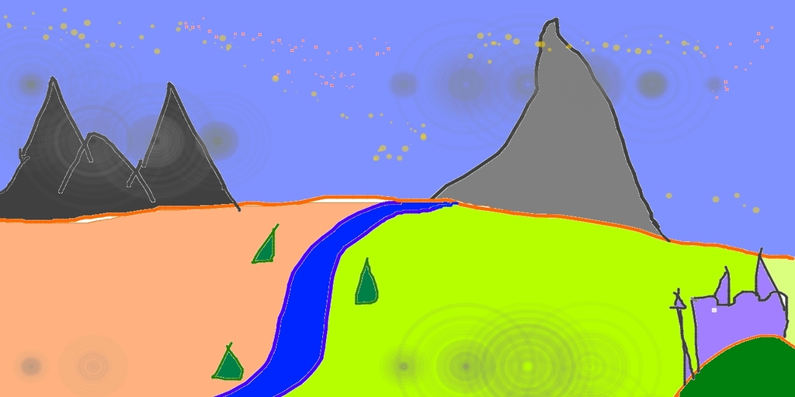

# Image2VanGogh

> The code is running on CPU, so it will be extremly slow. It takes ~10 minutes for 50 inference steps on replicate.com.

This work is based on this [repo](https://github.com/ovshake/replicate-img2img). This Python script allows you to generatea images using the Ghibli-Diffusion model trained with PyTorch. The generated images are based on an input image and a text prompt, and the output is a transformed version of the initial image guided by the provided text prompt.

## Image Transformation Example

Here is an example of how this model transforms an input image based on a text prompt.

The original image:

The transformed image with the prompt "A van gogh painting of a starry night":

As you can see, the transformed image retains the basic structure of the original image but modifies the colors and details to match the style suggested by the text prompt.s
